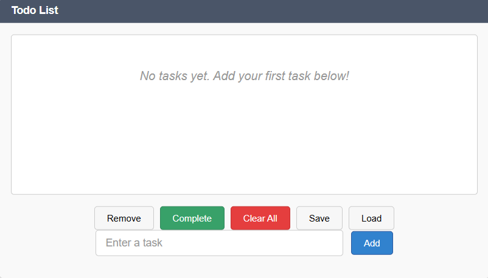
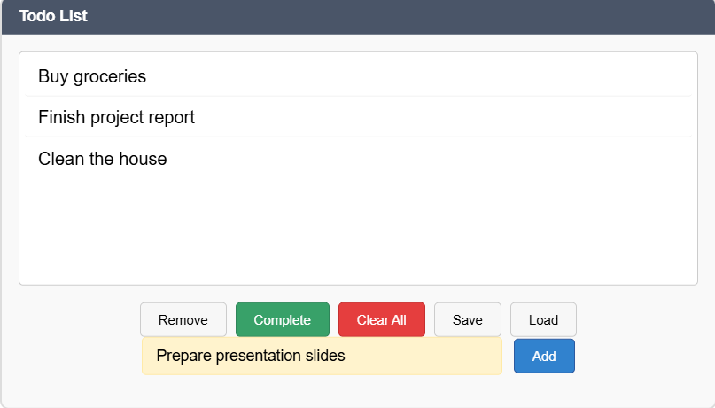
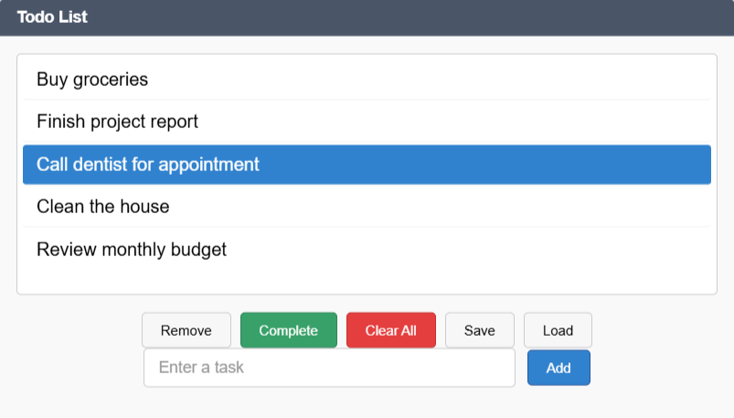
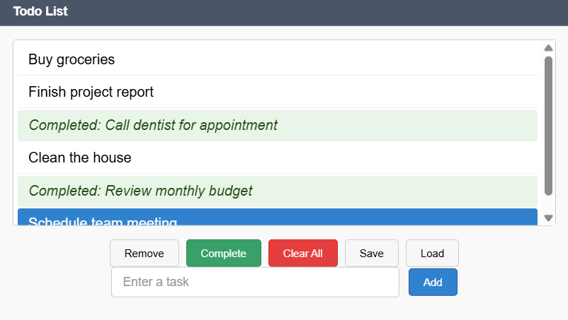
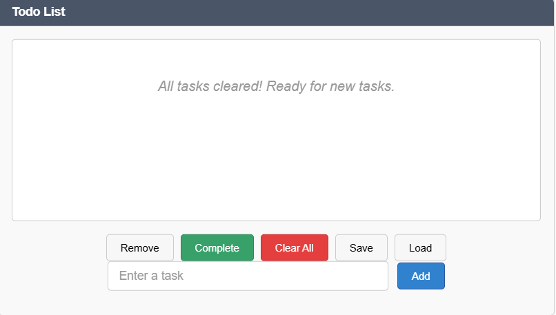

# JavaFX Todo List App

This is a simple Todo List desktop application built using **JavaFX**.

## Features
- Add tasks
- Remove selected tasks
- Mark tasks as completed
- Clear all tasks
- Save tasks to a file
- Load tasks from a file

## How to Run

1. Make sure you have Java and JavaFX installed.
2. Compile and run the `TodoListApp.java` file using your preferred IDE (e.g., IntelliJ, Eclipse) or from the terminal:

   ```bash
   javac TodoListApp.java
   java TodoListApp
   ````

## Screenshots

### Initial Application Launch



### Adding New Task



### Application with Tasks



### Tasks with Completed Items



### After Clear All




